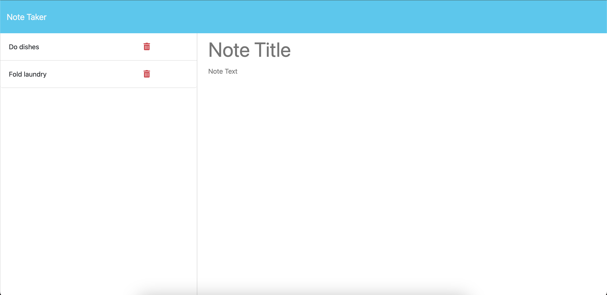

# Note Taker

## UCLA Bootcamp Module 11 Challenge

## Description

This project is a note taker so that the user is able to write and save notes. Upon opening the application, the following occurs:

1. The user will be presented with a landing page to get started.
2. Upon clicking the button to get started, it takes the user to a notes page.
3. The user will be able to see existing notes in the left-hand column.
3. The user will be able to click the existing notes and read the full contents in the right-hand column.
4. The user will be able to write a new note, save a note or clear the note by clicking a button in the header.
5. The user will be able to click the trash icon next to a note and delete the note.

## Installation

This project is deployed at: https://enigmatic-woodland-29234-dd1399ff8726.herokuapp.com/.

## Usage

## Credits

This project was created by Ramita Indurkhya.
